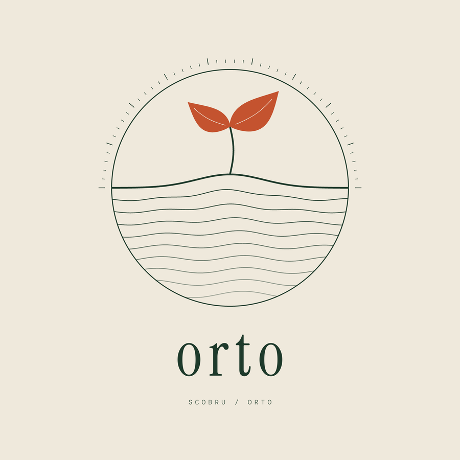

<p align="center"></p>

# Orto

*Formerly ZenOS.*

[![Buy me a coffee]](https://buymeacoffee.com/scobru)

[Buy me a coffee]: https://img.shields.io/badge/Buy%20me%20a%20coffee-scobru-FFDD00?logo=buymeacoffee&logoColor=black

Encrypted notes, calendar, tasks, bookmarks, contacts, secrets, files and a public blog, on **one small server you run yourself**: a Node script, one SQLite file and a folder of uploads. No ZEN/P2P network, no npm dependencies.

- **Server** (`server.js`): HTTP API + static hosting of the web app, SQLite via Node's built-in `node:sqlite` (Node ≥ 22.5).
- **SDK** (`orto.js`): works in Node and browsers (`fetch` + WebCrypto).
- **CLI** (`cli.js`): every app from the terminal, for scripts and AI agents.
- **Web app** (`web/`): served by the server itself, and also installable as a PWA.
- **Landing page** (`site/`).

## Run it

```bash
git clone https://github.com/scobru/orto.git
cd orto && npm start          # http://127.0.0.1:8787
```

One line, no clone and no Docker (needs Node ≥ 22.5; data goes in `./data`):

```bash
npx -y -p github:scobru/orto orto-server
```

Set things with env vars in front of it, e.g. `PORT=8080 ORTO_DATA=~/orto-data ORTO_ADMIN_PASS=change-me-please npx -y -p github:scobru/orto orto-server` (PowerShell: `$env:PORT=8080; npx -y -p github:scobru/orto orto-server`). It listens on `127.0.0.1` only; put HTTPS in front of it (Caddy, nginx, a tunnel) to use it from other devices.

Open the URL, type a username and password; the first time, the app offers to create the account.

Docker (includes the web app, data in the `zenos-data` volume): `docker compose up -d --build`, then open http://localhost:8787. The compose build also includes the optional tag suggestions (below); `ORTO_GIST=0 docker compose up -d --build` (or `--build-arg ORTO_GIST=0`) leaves them out. Or: `docker build -t orto . && docker run -d -p 8787:8787 -v zenos-data:/data orto`.

Put it behind a reverse proxy with HTTPS (Caddy, nginx) before exposing it to the internet.

| Env var | Default | |
|---|---|---|
| `PORT` / `HOST` | `8787` / `127.0.0.1` | listen address (`0.0.0.0` in Docker) |
| `ORTO_DATA` | `./data` | holds `orto.db` and `files/` — **back it up** (see below) |
| `ORTO_WEB` | `./web` | static files to serve |
| `ORTO_REGISTRATION` | `open` | `closed` once your accounts exist |
| `ORTO_MAX_UPLOAD` | 200 MB | per file, bytes |
| `ORTO_QUOTA` | 5 GB | per user, bytes |
| `ORTO_DEMO` / `ORTO_DEMO_HOURS` | off / `3` | public demo account, see below |
| `ORTO_ADMIN_PASS` | off | min 8 chars: turns on the admin panel at `/admin` (see below) |

**Media and big files.** *Media* in the sidebar plays music and video from your files: upload from there (or from Files), keep tracks in playlists, and the player stays on while you move around the app. Files uploaded from the web app, and from the CLI above 4 MB, are encrypted in 1 MiB chunks (AES-GCM, each chunk bound to its position and to the file), so the browser starts playing at once, seeking works, and memory stays small whatever the size; a service worker (`web/sw.js`) fetches and decrypts only the chunks the player asks for. Files uploaded the old way (single blob) still work and play after they are downloaded. The size limit per file is `ORTO_MAX_UPLOAD` (200 MB by default: raise it in the admin panel for video). A reverse proxy in front must pass `Range` requests and not buffer or cap big bodies (nginx: `client_max_body_size`, `proxy_request_buffering off`).

**Tag suggestions (optional, off by default).** `node scripts/install-gist.mjs` (already done by the Docker image unless you build it with `--build-arg ORTO_GIST=0`) installs [Gist](https://desertant.com/models/gist/) by Desert Ant Labs into `<data>/models/gist` (needs npm, once). Then each user can switch on *Settings > Tag suggestions* and use *Suggest tags* in a note's menu or the bookmark editor. The model (36 topics, 101 languages) runs in the browser, so the text is not sent anywhere; the first use downloads about 75 MB of model files from huggingface.co. Privacy details: the code runs in a sandboxed iframe that cannot read your keys or storage, its CSP only allows this server and huggingface.co, and the SDK's own usage reporting to its vendor is switched off (and blocked by that CSP). Gist is source-available, not MIT: free below 100,000 monthly active devices, credit required, see its [license](https://license.desertant.com/1.0). Nothing of it is in this repo.

**Admin panel.** Set `ORTO_ADMIN_PASS` and open `/admin`. From the browser you can change registration, max upload and quota (saved in the database, they override the env values until you press *Back to env defaults*), see every user with their usage, sign a user out everywhere or delete them, and write a backup under `<data>/backups/`. Passwords cannot be reset (everything is end-to-end encrypted), only removed. Serve it over HTTPS.

The old `ZENOS_*` variable names, a data folder holding `zenos.db` and the `zenos-data` Docker volume all keep working after the rename.

## Web app

Notes (Markdown, tags, checklists), Tasks (Kanban), Calendar, Bookmarks (Brave/Chrome/Firefox import and export), Contacts (vCard), Secrets (with a password generator), Files, **Photos** (thumbnail grid of your images; upload is manual, a browser cannot back up a camera roll) and a public Blog at `/blog/<username>`, all encrypted in the browser. **Settings** has export / import, your public links with revoke and change password. Use *Install* / *Add to Home Screen* to get it as an app (the service worker only keeps the app itself available: your data needs the server). Contacts, Secrets, Bookmarks, Tasks and Calendar have an *Examples* button with fake entries to try things out.

The app picks its server like this: the one set with the **Server** link on the login screen (it remembers the ones you used); otherwise the site it is served from, if that runs an Orto server; otherwise `https://orto.scobrudot.dev`. To host `web/` on a static host, open it and use the **Server** link to point it at your server (tokens are sent as `Authorization` headers, not cookies, so cross-origin works). Public links (`/s/...`) only work when the server itself serves the app.

## Demo account

`ORTO_DEMO=1 npm start` (or `ORTO_DEMO=1` in your Docker environment) adds a public **demo** account (user `demo`, password `demo`) that is wiped and refilled with random fake data (notes, tasks, events, bookmarks, contacts, secrets and 8 generated photos) at start and every `ORTO_DEMO_HOURS` (default 3) hours. The login screen shows *Try the demo account*, and `https://your-server/?demo` signs straight in, so you can link visitors to it.

It is still encrypted like any account; the password is just public. For the demo user the server turns off public links, public blog posts and password change (they would be shared by everyone), and caps it at 10 MB, 1000 records and 40 files. Other accounts on the same server are not touched. A real account that already has the name `demo` with another password is never wiped (the demo stays off and says so in the log). Visitors can still edit or delete what they see; the next reset puts everything back.

## Backup, migration, sharing

- **Server backup**: `node server.js backup <folder>` writes a consistent copy of the database and the uploads (safe while the server runs). Restore: stop the server and use that folder as `ORTO_DATA`.
- **Your own export**: `node cli.js export --out me.json` (or **Settings > Export** in the web app) saves everything decrypted; `node cli.js import --file me.json` loads it into any account on any server. That is also how you move to another server. The file is plain text: keep it safe.
- **Public links**: `node cli.js share-note --soul <soul>` / `share-file --id <id>` (or **Share** in the web app) give `https://<server>/s/<id>#<key>`. The item is encrypted with a fresh key that lives only in the `#fragment`, so the server never sees it; anyone with the link can read it. `share-revoke` deletes it.
- **Change password**: `node cli.js password-change --new '…'` (or Settings). It re-encrypts everything, then signs out your other sessions. Export first.

## How it stays private

Your login derives two independent keys with PBKDF2 (210k rounds): an **AES-GCM key** that never leaves the client, and an **auth secret** the server stores only as a hash. Notes, events, tasks, bookmarks, contacts, secrets, file contents *and* file names are encrypted before upload; the server (and anyone with the SQLite file) sees ciphertext, usernames, record ids and timestamps. The blog is the one public part.

Forget the password and the data is gone: there is no recovery, by design. Usernames are case-insensitive; the password is case-sensitive.

## CLI

```bash
export ORTO_SERVER=http://127.0.0.1:8787     # or --server; default https://orto.scobrudot.dev
node cli.js register --user alice --pass 'long passphrase'
node cli.js vault-write --user alice --pass '…' --title "Hello" --body "First note"
node cli.js vault-read  --user alice --pass '…'
node cli.js file-upload --user alice --pass '…' --file photo.png --folder Docs/2026 --album Trip
node cli.js file-list --folder Docs --table      # file-move --id <id> --album Pets to reorganize
node cli.js blog-publish --user alice --pass '…' --title Hi --content "Public post"
node cli.js blog-read --alias alice            # public, no login
node cli.js --help                             # every command
```

The CLI and SDK talk to `https://orto.scobrudot.dev` unless you set `ORTO_SERVER` / `--server` / `{ server }`.

Put `ORTO_USER` / `ORTO_PASS` in `.env` (see `.env.example`) to drop the flags.

## SDK

```js
import Orto from './orto.js';
const os = new Orto();   // default server: https://orto.scobrudot.dev
await os.login('alice', 'long passphrase', { create: true }); // create only the first time
await os.writeVaultNote({ title: 'Hello', body: 'First note' });
await os.writeTask({ title: 'Ship it', priority: 'high' });
const up = await os.uploadFile(new Uint8Array([1, 2, 3]), 'tiny.bin');      // encrypted client-side
const bytes = await os.downloadFile(up.id);
os.onTask((task, soul, deleted) => console.log(task, deleted));             // live updates (SSE)
```

Collections: `Vault`, `CalendarEvent`, `Task`, `Bookmark`, `Contact`, `Secret` each have `write*`, `get*`, `read*`, `delete*`, `on*`; plus `uploadFile/listFiles/downloadFile/deleteFile` (and `uploadFileChunked`, `readFileRange` for big files and streaming; `moveFile`, `fileGroups`, `addFileGroup`, `renameFileGroup` for folders, albums and playlists), `shareNote/shareFile/listShares/unshare` (+ `readShare(link)`), `exportAll/importAll/changePassword` and `publishBlogPost/readBlogPosts/getBlogPost/deleteBlogPost/onPost`. See [llm.txt](llm.txt).

## HTTP API

All JSON. `Authorization: Bearer <token>` from `POST /api/login` or `/api/register` (`{name, auth}`).

| | |
|---|---|
| `GET /api/c/:collection` | list records |
| `GET/PUT/DELETE /api/c/:collection/:soul` | one record (PUT body is stored as-is; clients send `{data: <ciphertext>}`) |
| `GET /api/events` | server-sent events for your collections |
| `POST /api/files` (raw body), `GET/PUT/DELETE /api/files/:id` | blobs (PUT replaces in place) |
| `POST /api/s` (`{data}` JSON or raw bytes), `DELETE /api/s/:id` | create / revoke a public share |
| `GET /api/s/:id` | public ciphertext of a share, no auth (`/s/:id#key` is the page) |
| `POST /api/password` (`{auth, newAuth}`; `check: true` = dry run) | swap the login secret after re-encrypting |
| `GET /api/config` | `{registration, maxUpload, demo?}` (no auth) |
| `GET /api/u/:name`, `GET /api/u/:name/posts` | public profile and blog, no auth |
| `GET /blog/:name` | public blog page (e.g. https://orto.scobrudot.dev/blog/scobru) |

## Tests

`npm test` starts a throwaway server on a temp SQLite file and runs the whole SDK against it (encryption at rest, isolation between users, files, live events, share links, export/import, password change, backup).

## Coming from ZenOS or the ZEN version

Nothing to migrate from ZenOS: same data, same logins (the key derivation keeps its original `zenos:v1:` salt on purpose). Just pull, restart, and keep using your data folder.

The oldest build kept data in the ZEN graph under a secp256k1 identity; this one uses a different identity and storage, so the two do not share data. To move over: export bookmarks / contacts (HTML / vCard) from the old app and import them here; copy notes by hand or with a script using both SDKs. 

## License

MIT
